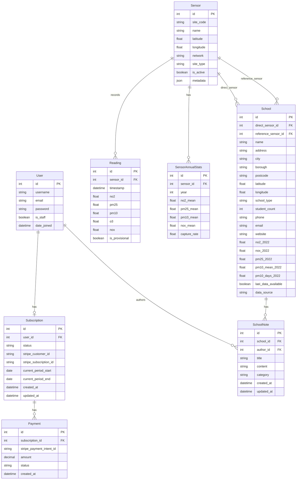

# Early Years Schools Pollution Monitor

**A Django-based real-time air quality monitoring platform for primary schools and nurseries in Lambeth and Southwark.**


---

## Table of Contents

- [Overview](#overview)
- [User Stories](#user-stories)
- [Wireframes](#wireframes)
- [Features](#features)
- [Database Schema](#database-schema)
- [Technology Stack](#technology-stack)
- [Installation](#installation)
- [Configuration](#configuration)
- [Running the Application](#running-the-application)
- [Data Management](#data-management)
- [Testing](#testing)
- [Validation](#validation)
- [Deployment](#deployment)
- [Project Structure](#project-structure)
- [Security Notes](#security-notes)
- [Future Enhancements](#future-enhancements)
- [License](#license)
- [Author](#author)
- [Acknowledgments](#acknowledgments)

---

## Overview

Early Years Schools Pollution Monitor helps parents, school administrators, and policymakers make informed decisions about children's exposure to air pollution. The platform combines real-time sensor data from the London Air Quality Network (LAQN) and Breathe London with modelled pollution data (LAEI 2022) to provide comprehensive air quality information for 133 schools across Lambeth and Southwark.

**Live Demo:** [https://schools-air-quality-msp4-39fe66170249.herokuapp.com/](https://schools-air-quality-msp4-39fe66170249.herokuapp.com/)

### Key Objectives

- **Real-time monitoring:** Hourly updates from active sensors across two networks (LAQN and Breathe London)
- **Hybrid data approach:** Direct sensor readings where available, modelled data with real-time adjustments elsewhere
- **Tiered access:** Free map for all visitors; subscription-based premium features (£2.50/month via Stripe)
- **Transparency:** Clear data source attribution for every school

---

## User Stories

User stories were used to guide development using Agile methodology. Stories are grouped by user type and mapped to assessment learning outcomes where applicable.

### Parent / Family (Free Tier)

| ID    | As a... | I want to...                                         | So that...                                                         | Status  | LO  |
| ----- | ------- | ---------------------------------------------------- | ------------------------------------------------------------------ | ------- | --- |
| US-01 | Parent  | View an interactive map showing all schools          | I can see air quality across my area at a glance                   | ✅ Done | LO1 |
| US-02 | Parent  | See colour-coded pollution levels on the map         | I can quickly identify which schools have good or poor air quality | ✅ Done | LO1 |
| US-03 | Parent  | Search for a school by name or postcode              | I can find my child's school quickly                               | ✅ Done | LO1 |
| US-04 | Parent  | Filter schools by borough                            | I can focus on schools relevant to me                              | ✅ Done | LO1 |
| US-05 | Parent  | View detailed air quality data for a specific school | I can understand the pollution levels in detail                    | ✅ Done | LO2 |
| US-06 | Parent  | See where the data comes from (sensor vs modelled)   | I can judge how reliable the reading is                            | ✅ Done | LO1 |
| US-07 | Parent  | Register for an account                              | I can access additional features                                   | ✅ Done | LO3 |
| US-08 | Parent  | Add community notes about a school's environment     | I can share observations with other parents                        | ✅ Done | LO2 |

### Subscriber (Paid Tier — £2.50/month)

| ID    | As a...    | I want to...                    | So that...                                  | Status  | LO  |
| ----- | ---------- | ------------------------------- | ------------------------------------------- | ------- | --- |
| US-09 | Subscriber | Pay securely via Stripe         | I can access premium features safely        | ✅ Done | LO4 |
| US-10 | Subscriber | Manage my subscription status   | I can see when it renews or cancel it       | ✅ Done | LO4 |
| US-11 | Subscriber | Edit school contact information | I can keep details up to date for my school | ✅ Done | LO2 |
| US-12 | Subscriber | Edit and delete my own notes    | I can correct or remove my contributions    | ✅ Done | LO2 |

### Site Administrator

| ID    | As a... | I want to...                           | So that...                                     | Status  | LO  |
| ----- | ------- | -------------------------------------- | ---------------------------------------------- | ------- | --- |
| US-13 | Admin   | Access the Django admin panel          | I can manage all data and users                | ✅ Done | LO2 |
| US-14 | Admin   | View and manage all school notes       | I can moderate community content               | ✅ Done | LO2 |
| US-15 | Admin   | See which data source each school uses | I can monitor data quality across the platform | ✅ Done | LO1 |
| US-16 | Admin   | View subscription and payment records  | I can handle customer support queries          | ✅ Done | LO4 |

### Authentication & Security

| ID    | As a... | I want to...                     | So that...                        | Status  | LO  |
| ----- | ------- | -------------------------------- | --------------------------------- | ------- | --- |
| US-17 | User    | Log in and log out securely      | My account is protected           | ✅ Done | LO3 |
| US-18 | User    | Reset my password if I forget it | I can regain access to my account | ✅ Done | LO3 |

---

## Wireframes

Wireframes were created during the design phase to plan the layout and user experience of key pages. The application follows a mobile-first responsive approach using Bootstrap 5.

### Map View (Home Page)

```
┌──────────────────────────────────────────────────────┐
│  Early Years Schools Pollution Monitor                │
│  [Map] [Schools] [My Account] [Login] [Register]     │
├──────────────────────────────────────────────────────┤
│                                                       │
│  ┌─────────────────────────────────────────────────┐ │
│  │                                                  │ │
│  │              LEAFLET MAP                         │ │
│  │                                                  │ │
│  │    📍 School markers (colour-coded by AQ)        │ │
│  │    📍 Sensor markers (LAQN / Breathe London)     │ │
│  │                                                  │ │
│  │  ┌──────────────────┐                           │ │
│  │  │ Legend            │                           │ │
│  │  │ 🟢 Good          │                           │ │
│  │  │ 🟡 Moderate      │                           │ │
│  │  │ 🔴 Poor          │                           │ │
│  │  └──────────────────┘                           │ │
│  └─────────────────────────────────────────────────┘ │
│                                                       │
├──────────────────────────────────────────────────────┤
│  Footer: © 2026 | LAQN | Breathe London | LAEI 2022  │
└──────────────────────────────────────────────────────┘
```

### Schools List

```
┌──────────────────────────────────────────────────────┐
│  Early Years Schools Pollution Monitor                │
│  [Map] [Schools] [My Account] [Logout]               │
├──────────────────────────────────────────────────────┤
│                                                       │
│  Schools (133 found)                                  │
│                                                       │
│  [Search by name or postcode______] [Borough ▼]      │
│                                                       │
│  ┌────────────────────────────────────────────┐      │
│  │ 📍 Archbishop Sumner Primary      [LAQN]   │      │
│  │    SE1 7AA · Lambeth · Primary School      │      │
│  │    View Details →                           │      │
│  ├────────────────────────────────────────────┤      │
│  │ 📍 Bessemer Grange Primary     [ADJUSTED]  │      │
│  │    SE5 0BE · Southwark · Primary School    │      │
│  │    View Details →                           │      │
│  ├────────────────────────────────────────────┤      │
│  │ 📍 Charles Dickens Primary     [LAEI]      │      │
│  │    SE1 1QQ · Southwark · Primary School    │      │
│  │    View Details →                           │      │
│  └────────────────────────────────────────────┘      │
│                                                       │
├──────────────────────────────────────────────────────┤
│  Footer                                               │
└──────────────────────────────────────────────────────┘
```

### School Detail

```
┌──────────────────────────────────────────────────────┐
│  Early Years Schools Pollution Monitor                │
│  [Map] [Schools] [My Account] [Logout]               │
├──────────────────────────────────────────────────────┤
│                                                       │
│  Archbishop Sumner Primary School                     │
│  SE1 7AA · Lambeth                                    │
│                                                       │
│  ┌─ Current Air Quality ──────────────────────┐      │
│  │  NO₂: 32.5 µg/m³  ✅ Below WHO guideline   │      │
│  │  PM2.5: 8.2 µg/m³  ⚠️ Above WHO guideline  │      │
│  │  PM10: 15.1 µg/m³  ✅ Below WHO guideline   │      │
│  │  Source: ADJUSTED · Confidence: Medium       │      │
│  └─────────────────────────────────────────────┘      │
│                                                       │
│  ┌─ WHO Threshold Comparison ─────────────────┐      │
│  │  Pollutant │ Value  │ Guideline │ Status    │      │
│  │  NO₂       │ 32.5   │ 25.0      │ ⚠️ Above │      │
│  │  PM2.5     │ 8.2    │ 15.0      │ ✅ Below  │      │
│  │  PM10      │ 15.1   │ 45.0      │ ✅ Below  │      │
│  └─────────────────────────────────────────────┘      │
│                                                       │
│  ┌─ Community Notes ──────────────────────────┐      │
│  │  [Add Note]                                 │      │
│  │                                              │      │
│  │  📝 Heavy traffic at drop-off times         │      │
│  │     By: parent123 · 25 Feb 2026             │      │
│  │     [Edit] [Delete]                          │      │
│  └─────────────────────────────────────────────┘      │
│                                                       │
├──────────────────────────────────────────────────────┤
│  Footer                                               │
└──────────────────────────────────────────────────────┘
```

### Subscription Page

```
┌──────────────────────────────────────────────────────┐
│  Early Years Schools Pollution Monitor                │
│  [Map] [Schools] [My Account] [Logout]               │
├──────────────────────────────────────────────────────┤
│                                                       │
│  Air Quality Dashboard Subscription                   │
│                                                       │
│  ┌────────────────────────────────────────────┐      │
│  │  Subscribe to Access Premium Features       │      │
│  │                                              │      │
│  │  £2.50 / month                               │      │
│  │                                              │      │
│  │  ✓ Edit school contact details              │      │
│  │  ✓ Manage community notes                   │      │
│  │  ✓ Priority support                         │      │
│  │                                              │      │
│  │  ┌──────────────────────────────────────┐   │      │
│  │  │ For Assessment: Use test card         │   │      │
│  │  │ 4242 4242 4242 4242                   │   │      │
│  │  └──────────────────────────────────────┘   │      │
│  │                                              │      │
│  │  [ Subscribe Now ]                           │      │
│  │                                              │      │
│  │  Secure payment powered by Stripe.           │      │
│  └────────────────────────────────────────────┘      │
│                                                       │
├──────────────────────────────────────────────────────┤
│  Footer                                               │
└──────────────────────────────────────────────────────┘
```

### Authentication Pages

```
┌─ Login ──────────────────┐  ┌─ Register ────────────────┐
│                           │  │                            │
│  Login                    │  │  Create Account            │
│                           │  │                            │
│  Username: [___________]  │  │  Username: [___________]   │
│  Password: [___________]  │  │  Email:    [___________]   │
│                           │  │  Password: [___________]   │
│  [ Sign In ]              │  │  Confirm:  [___________]   │
│                           │  │                            │
│  Forgot password?         │  │  [ Register ]              │
│  Don't have an account?   │  │                            │
│  Register here            │  │  Already registered?       │
│                           │  │  Login here                │
└───────────────────────────┘  └────────────────────────────┘
```

---

## Features

### Implemented (MVP)

**Interactive Map:** Leaflet-based map displaying 133 schools and 42 sensors with colour-coded markers indicating pollution levels. Schools show popup cards with current readings, data source badges, and WHO guideline comparisons.

**Tiered Data Sources:** Three-tier approach for air quality data — direct sensor readings for schools within 150m of a Breathe London sensor, LAEI baseline adjusted by real-time LAQN reference data for schools with a nearby reference sensor, and static LAEI 2022 modelled data as fallback.

**School Directory:** Searchable, filterable list of all 133 schools with detail pages showing current air quality, WHO threshold comparison tables, and community notes.

**Community Notes (CRUD):** Authenticated users can create, read, update, and delete notes about schools. Authors can only edit/delete their own notes. Categories include observation, concern, improvement, and update.

**Stripe Subscription:** Full e-commerce flow using Stripe Checkout for £2.50/month subscription. Includes webhook handling for subscription lifecycle events (created, updated, cancelled) and payment audit trail.

**Authentication System:** Django-based registration, login, logout, and password reset. Custom templates styled with Bootstrap 5. Role-based permissions — staff users can edit school contact details, subscribers access premium features.

**Responsive Design:** Bootstrap 5 with custom CSS. Accessible navigation with skip links, ARIA labels, and semantic HTML. Footer with data source attribution links.

---

## Database Schema

The application uses a relational database with 8 models across 4 Django apps:



The schema centres on three domains. **Schools** stores 133 primary schools and nurseries, each linked to up to two **Sensors** via `direct_sensor` (urban background sensor within 150m) and `reference_sensor` (nearest LAQN sensor for adjustment factors). Sensors produce **Readings** (hourly pollutant concentrations) and **SensorAnnualStats** (annual means used to calculate adjustment factors). **SchoolNotes** allow authenticated users to share community observations about a school's air quality environment. The **Subscription** and **Payment** models handle Stripe-based access control, with a one-to-one link between User and Subscription.

---

## Technology Stack

### Backend

- **Python 3.13**
- **Django 4.2** — Web framework
- **PostgreSQL 17** — Primary database
- **psycopg2** — PostgreSQL adapter
- **WhiteNoise** — Static file serving

### Frontend

- **Bootstrap 5** — Responsive UI framework
- **Leaflet.js** — Interactive mapping
- **Vanilla JavaScript** — Client-side scripting

### APIs & Data Sources

- **London Air Quality Network (LAQN)** — Reference-grade monitoring stations
- **Breathe London via OpenAQ** — Calibrated low-cost sensors
- **LAEI 2022** — London Atmospheric Emissions Inventory (modelled baseline)

### Payment Processing

- **Stripe** — Subscription billing (£2.50/month)

### Testing

- **Django TestCase** — Unit and integration tests
- **Coverage.py** — Test coverage analysis

### Deployment

- **Heroku** — Cloud platform (PostgreSQL addon, Scheduler addon)
- **Heroku Scheduler** — Automated hourly data fetching
- **Git/GitHub** — Version control and repository

---

## Installation

### Prerequisites

- Python 3.13+
- PostgreSQL 17
- Git

### Step 1: Clone Repository

```bash
git clone https://github.com/GavinKingcome/schools_air_quality_msp4.git
cd schools_air_quality_msp4
```

### Step 2: Create Virtual Environment

```bash
python -m venv venv
source venv/bin/activate  # On macOS/Linux
# venv\Scripts\activate   # On Windows
```

### Step 3: Install Dependencies

```bash
pip install -r requirements.txt
```

### Step 4: Set Up PostgreSQL

```sql
CREATE DATABASE schools_air_quality_db;
CREATE USER your_username WITH PASSWORD 'your_password';
GRANT ALL PRIVILEGES ON DATABASE schools_air_quality_db TO your_username;
```

### Step 5: Configure Environment Variables

Create a `.env` file in the project root:

```env
SECRET_KEY=your-secret-key-here
DEBUG=True
ALLOWED_HOSTS=localhost,127.0.0.1
DB_NAME=schools_air_quality_db
DB_USER=your_username
DB_PASSWORD=your_password
DB_HOST=localhost
DB_PORT=5432
BREATHE_LONDON_API_KEY=your-api-key-here
STRIPE_PUBLISHABLE_KEY=pk_test_YOUR_KEY
STRIPE_SECRET_KEY=sk_test_YOUR_KEY
STRIPE_WEBHOOK_SECRET=whsec_YOUR_SECRET
STRIPE_PRICE_ID=price_YOUR_PRICE_ID
```

### Step 6: Run Migrations

```bash
python manage.py migrate
```

### Step 7: Load Initial Data

```bash
python manage.py import_schools data/schools.csv
python manage.py sync_laqn_sensors
python manage.py sync_breathe_sensors
python manage.py fetch_laqn_readings
python manage.py fetch_breathe_readings
```

### Step 8: Create Superuser

```bash
python manage.py createsuperuser
```

---

## Configuration

### API Keys

**Breathe London:** Register at [breathelondon.org](https://www.breathelondon.org/), request an API key (2–3 day approval), and add to `.env` as `BREATHE_LONDON_API_KEY`.

**LAQN:** No API key required. Public endpoint at `https://api.erg.ic.ac.uk/AirQuality/`.

### Stripe Setup

1. Create a free account at [stripe.com](https://stripe.com)
2. Switch to **Test mode** in the dashboard
3. Go to Product Catalog → Add Product → "Air Quality Dashboard Access" at £2.50/month recurring
4. Copy the Price ID (starts with `price_`) and API keys to `.env`

### Email (Password Reset)

Development uses Django's console email backend — reset links print to the terminal. On Heroku, they appear in `heroku logs --tail`. For production SMTP, configure SendGrid, Mailgun, or Gmail in `.env`.

---

## Running the Application

### Development Server

```bash
python manage.py runserver
```

Access at [http://127.0.0.1:8000/](http://127.0.0.1:8000/)

### Automated Data Updates (Production)

Heroku Scheduler runs hourly data fetches:

- `:10` — `python manage.py fetch_laqn_readings`
- `:20` — `python manage.py fetch_breathe_readings`

---

## Data Management

### Management Commands

```bash
python manage.py import_schools data/schools.csv    # Import schools from CSV
python manage.py sync_laqn_sensors                   # Sync LAQN sensors
python manage.py sync_breathe_sensors                # Sync Breathe London sensors
python manage.py fetch_laqn_readings                 # Fetch latest LAQN readings
python manage.py fetch_breathe_readings              # Fetch latest Breathe readings
```

### Data Sources

**LAEI 2022 (Baseline):** 20m × 20m grid modelled pollution concentrations from the Greater London Authority. Provides baseline NO₂, NOx, PM2.5, PM10 for each school.

**LAQN (Reference-Grade):** 3 active stations in Lambeth/Southwark providing hourly validated readings (16 registered, most currently inactive). Used to calculate real-time adjustment factors against annual means.

**Breathe London:** 26 calibrated sensors in the study area. Provides direct readings for schools within 150m. Urban background site type only.

---

## Testing

### Running Tests

```bash
python manage.py test                    # All tests
python manage.py test schools            # Schools app
python manage.py test air_quality        # Air quality app
python manage.py test maps               # Maps app
python manage.py test subscriptions      # Subscriptions app
```

**Current Status:** 39/39 tests passing.

Tests cover model creation, string representations, unique constraints, view responses, template rendering, JSON data structure, CRUD permissions, data source selection logic, and adjustment factor calculations.

---

## Validation

### HTML Validation

All pages validated using the [W3C Markup Validation Service](https://validator.w3.org/). No errors found.

### CSS Validation

Stylesheet validated using the [W3C CSS Validation Service (Jigsaw)](https://jigsaw.w3.org/css-validator/). No errors found.

### JavaScript

Not formally validated. Code uses ES6 features (const, arrow functions, template literals) and relies on Leaflet.js external library.

### Python (PEP8)

Not formally validated. Minor whitespace and line length issues remain.
---

## Deployment

### Heroku Deployment

The application is deployed to Heroku with the following configuration:

1. **Heroku app created** with PostgreSQL addon
2. **Environment variables** set via `heroku config:set`
3. **Procfile** configured with `web: gunicorn schools_air_quality_msp4.wsgi`
4. **Static files** served via WhiteNoise with `CompressedManifestStaticFilesStorage`
5. **Heroku Scheduler** configured for hourly data fetches

**Deploy commands:**

```bash
git push heroku main
heroku run python manage.py migrate -a schools-air-quality-msp4
```

**Live URL:** [https://schools-air-quality-msp4-39fe66170249.herokuapp.com/](https://schools-air-quality-msp4-39fe66170249.herokuapp.com/)

### Demo Credentials

For assessment purposes, register a new account on the live site and subscribe using Stripe test card `4242 4242 4242 4242` (any future expiry, any CVC) to test the full e-commerce flow.

---

## Project Structure

```
schools_air_quality_msp4/
├── air_quality/                  # Air quality data app
│   ├── models.py                # Sensor, Reading, SensorAnnualStats
│   ├── services/                # API integration services
│   │   ├── breathe_london_api.py
│   │   └── laqn_api.py
│   ├── management/commands/     # Data fetching commands
│   └── tests.py
├── schools/                      # Schools app
│   ├── models.py                # School, SchoolNote
│   ├── views.py                 # List, detail, edit, CRUD notes
│   ├── forms.py                 # SchoolContactForm, SchoolNoteForm
│   ├── admin.py
│   ├── test_data_sources.py     # Data source selection tests
│   └── templates/schools/
│       ├── schools_list.html
│       ├── school_detail.html
│       ├── school_edit.html
│       ├── note_form.html
│       └── note_confirm_delete.html
├── maps/                         # Map visualisation app
│   ├── views.py                 # Map view with school/sensor data
│   ├── templates/maps/
│   │   └── map.html             # Leaflet map interface
│   └── tests.py
├── subscriptions/                # Stripe subscription app
│   ├── models.py                # Subscription, Payment
│   ├── views.py                 # Checkout, webhooks, management
│   ├── decorators.py            # @subscription_required
│   ├── templates/subscriptions/
│   │   ├── subscription.html
│   │   ├── success.html
│   │   ├── cancel.html
│   │   └── manage.html
│   └── admin.py
├── static/                       # Static assets
│   ├── css/style.css
│   └── js/
├── templates/                    # Project-level templates
│   ├── base.html
│   └── registration/
│       ├── login.html
│       ├── register.html
│       ├── password_reset_form.html
│       ├── password_reset_done.html
│       ├── password_reset_confirm.html
│       └── password_reset_complete.html
├── data/                         # CSV data files
│   └── schools.csv
├── .env                          # Environment variables (not in git)
├── .gitignore
├── Procfile
├── requirements.txt
├── runtime.txt
├── manage.py
└── README.md
```

---

## Security Notes

### For Assessors

**Stripe Integration:** The `@subscription_required` decorator is active on the `school_edit` view. The map is freely accessible. To test the subscription flow, register an account and subscribe using test card `4242 4242 4242 4242`.

**API Key Management:** All sensitive keys are stored in environment variables via `.env` (local) and Heroku config vars (production). The `.gitignore` file prevents `.env` from being committed.

**Lessons Learned:** The `.env` file was accidentally committed to git history early in development (3 commits). This was resolved by immediately rotating the Django `SECRET_KEY` and ensuring `.gitignore` was properly configured.

### Production Checklist

- [ ] Set `DEBUG=False` in production
- [ ] Use production Stripe keys
- [ ] Configure `ALLOWED_HOSTS` with actual domain
- [ ] Enable HTTPS/SSL
- [ ] Set up monitoring and error tracking
- [ ] Configure regular database backups

---

## Future Enhancements

**Tiered Pricing:** Free tier for parents/families (basic map view), paid tier for schools/administrators (£2.50/month, full features including historical trends, comparisons, and data export).

**Air Quality Alerts:** Email and SMS notifications when pollution exceeds WHO thresholds, with recommended actions for schools.

**Historical Trends:** Interactive graphs showing pollution over time, seasonal patterns, and year-on-year comparisons.

**Data Export:** PDF reports for school governors, CSV downloads for researchers, and API access for third-party integrations.

**Borough Expansion:** Scale from 2 boroughs to all 33 London boroughs. Migration to TimescaleDB recommended when exceeding 100,000 sensor readings.

---

## License

This project is licensed under the MIT License.

---

## Author

**Gavin Kingcome**

- GitHub: [@GavinKingcome](https://github.com/GavinKingcome)
- Email: gavin@gavinkingcome.com

---

## Acknowledgments

- **London Air Quality Network (LAQN)** — Reference-grade monitoring data
- **Breathe London** — Calibrated sensor network
- **Greater London Authority** — LAEI 2022 modelled data
- **OpenAQ** — Open air quality data platform
- **Code Institute** — Project supervision and guidance
- **GitHub Copilot** — AI-powered development assistance
- **Claude (Anthropic)** — AI-assisted brainstorming, debugging, and development support
- **Django Documentation** — Official documentation and tutorials
- **William S. Vincent** — _Django for Beginners_ — Foundational Django concepts

---

**Last Updated:** 27 February 2026
